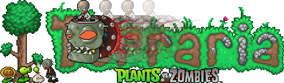

# Zombies from PvZ DS

  

(WIP) Changes some zombies (subject to change) and the music with some from PvZ DS. It also changes the bestiary to add the zombies descriptions from the original PvZ suburban almanac.

## Installation

<a href="https://steamcommunity.com/sharedfiles/filedetails/?id=3434443215">Subscribe and download from Steam</a>

## Aviso legal

> **Este pack de recursos es un proyecto de fans sin fines de lucro.**

- Todos los sprites, sonidos y música utilizados que provienen de **Plants vs. Zombies** son propiedad intelectual de **PopCap Games** y **Electronic Arts**.
- Este proyecto no está afiliado, respaldado ni autorizado por EA o PopCap.
- El resource pack se distribuye con **fines educativos y no comerciales**.

## Créditos

- **Edición:** K0Y0Y
- **Arte:** Plants vs. Zombies DS (PopCap / EA)
- **Música:** Laura Shigihara
- **The The Wise Willow:** The Wise Willow for allowing me to use the<a href="https://steamcommunity.com/sharedfiles/filedetails/?id=2440766780&searchtext=Colored+relics">Bosses Colored Relic</a> RP.
- **Sprites y assets:** <a href="https://www.spriters-resource.com/">The Spriters resource</a>
